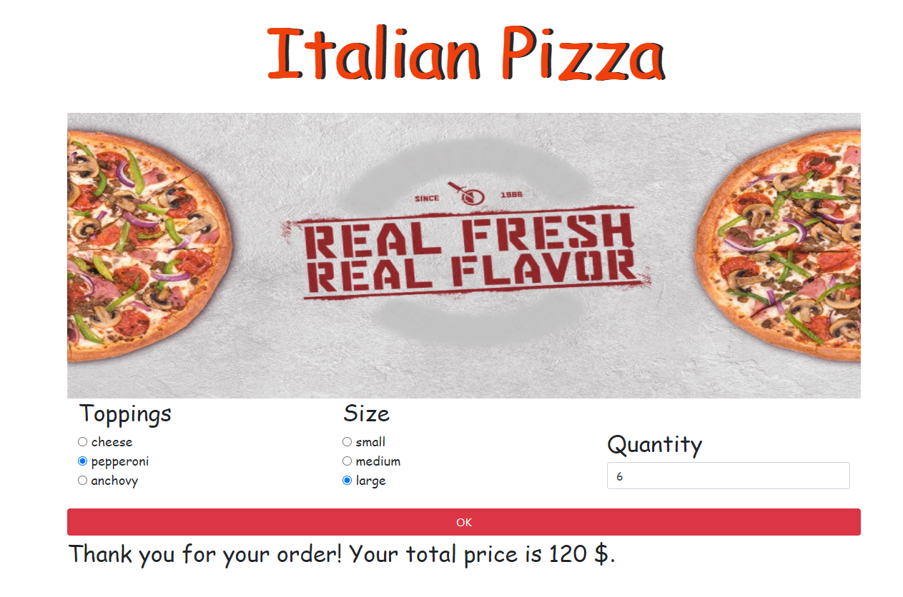

# **Italian Pizza**
By Olha Hizhytska

This website is for a pizza company where a user can choose one of the individual toppings (cheese, pepperoni, anchovy), size to order a pizza and the wished quantity. After selecting available options, the total cost of the order will be displayed.

## Technologies Used:

* JavaScript
* HTML
* CSS
* jQuery
* Bootstrap

## Description

This application demonstrates practicing object-oriented-JavaScript, in which I created:
 - user form to gather input data.
 - object constructor with properties for toppings, size and quantity.
 - prototype method for the individual cost of a pizza, depending on the selections chosen.
 - prototype method for the total price, depending on the individual price and the quantity chosen.

 
## Setup

- Clone this repository to your desktop, using next command:

  git clone https://github.com/OlgaHi/Italian-Pizza.git

- Navigate to the top level of the directory.

  cd Italian-Pizza

- Open index.html in your browser.

## Specs
Describe: Pizza()

1.Test: "Object constructor Pizza should create a new object with specified properties".
Expect: (new Pizza(topping, size, quantity)).toEqual(pizza1("cheese", "small", "1")).

2.Test: "Prototype method calculatePrice should calculate the individual price for the instance, depending of the user selection.
Expect: (pizza1.calculatePrice("cheese", "small", "1").toEqual(10)).

3.Test: "Prototype method calculatePrice should update the value of the price.
Expect: (pizza1.price).toEqual(10).

4.Test: "Prototype method calculateTotalPrice should calculate the total price for the instance, depending of the user selection.
Expect: (pizza1.calculateTotalPrice("cheese", "small", "2").toEqual(20)).

5.Test: "Prototype method calculateTotalPrice should update total price for their instance".
Expect: (pizza1.totalPrice).toEqual(20).

## Known Bugs

- No known issues

## License

[MIT](https://en.wikipedia.org/wiki/MIT_License)
Copyright (c) 2021 Olha Hizhytska

## Contact Information

- Olha Hizhytska olgainfotech@gmail.com

## You can see this project [here](https://olgahi.github.io/Italian-Pizza/)